# Computer Vision Programs - OpenCV Experiments

This repository contains a structured collection of **40 Computer Vision experiments** implemented in Python using the **OpenCV (Open Source Computer Vision Library)**. 

Each experiment demonstrates a key concept in image processing, ranging from basic manipulation (scaling, translating, rotating) to advanced features (homography, morphology, segmentation, face detection, and video analysis).

---

## 🛠️ Setup & Execution

### Prerequisites
Make sure you have Python 3.x installed along with the required libraries:
```bash
pip install opencv-python numpy matplotlib
```

### Running an Experiment
You can execute any script directly using python. For example, to run Experiment 1:
```bash
python exp1.py
```

---

## 📋 Experiment Directory & Outputs

Here is the complete list of experiments in sequential order, along with their description and output screenshots.

### 🔬 Experiment 1: Grayscale Conversion
- **Code File:** [exp1.py](/exp1.py)
- **Description:** Reads a color image, converts it to grayscale using `cv2.cvtColor`, and displays both the original and grayscale outputs.
- **Outputs:**
  - *Grayscale*:
  
  - *Original*:
  

---

### 🔬 Experiment 2: Gaussian Blur
- **Code File:** [exp2.py](/exp2.py)
- **Description:** Applies a Gaussian smoothing filter to an image using `cv2.GaussianBlur` and saves the blurred image to disk.
- **Outputs:**
  - *Blurred Image*:
  
  - *Original Image*:
  

---

### 🔬 Experiment 3: Image Resizing
- **Code File:** [exp3.py](/exp3.py)
- **Description:** Loads an image and resizes it to a fixed size of 600x600 pixels using `cv2.resize`.
- **Outputs:**
  - *image*:
  
  - *original image*:
  

---

### 🔬 Experiment 4: Image Rotation (Clockwise & Counter-Clockwise)
- **Code File:** [exp4.py](/exp4.py)
- **Description:** Rotates an image by 45 degrees clockwise and counter-clockwise using `cv2.getRotationMatrix2D` and `cv2.warpAffine`.
- **Outputs:**
  - *Clockwise Rotation*:
  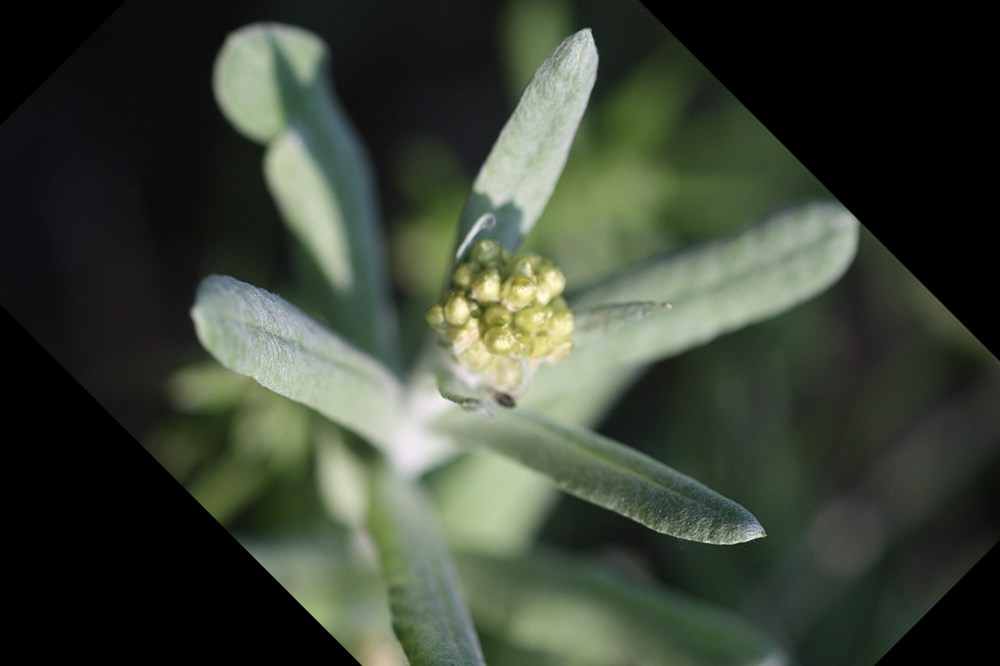
  - *Counterclockwise Rotation*:
  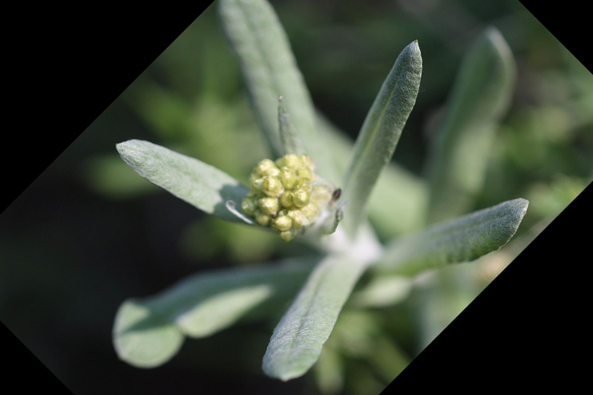
  - *Original Image*:
  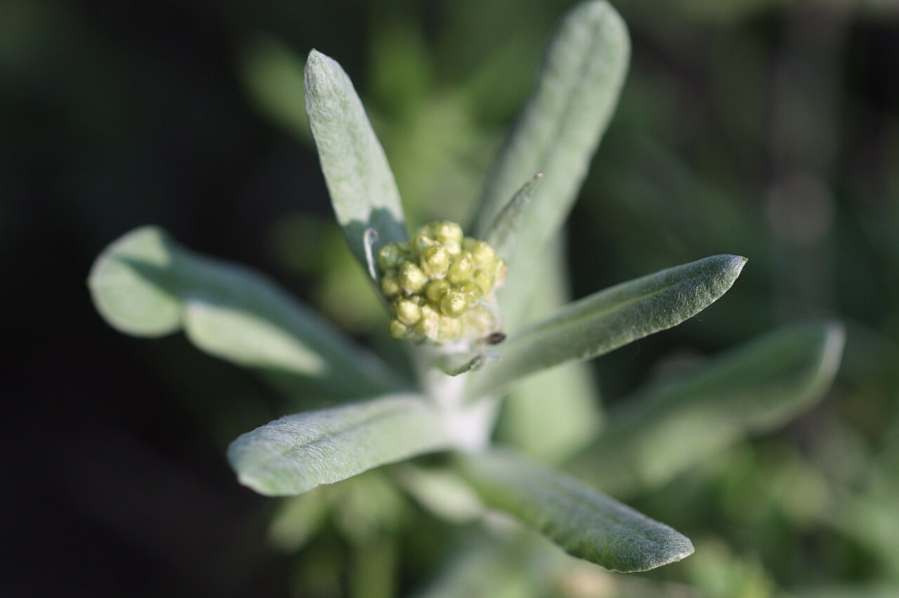

---

### 🔬 Experiment 5: Image Translation (Movement)
- **Code File:** [exp5.py](/exp5.py)
- **Description:** Translates/shifts an image by 100 pixels horizontally and 50 pixels vertically using an affine translation matrix.
- **Outputs:**
  - *Original Image*:
  
  - *Translated Image*:
  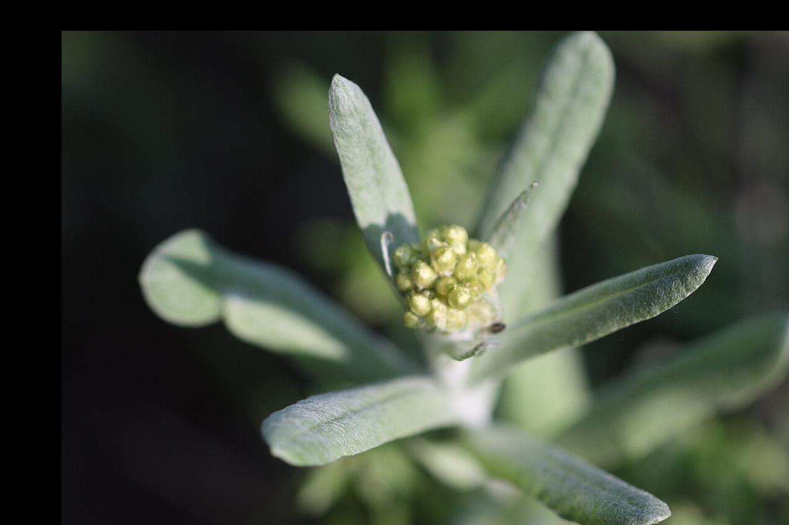

---

### 🔬 Experiment 6: Canny Edge Detection
- **Code File:** [exp6.py](/exp6.py)
- **Description:** Applies the Canny edge detector to a grayscale image using `cv2.Canny` to extract high-frequency structural boundaries.
- **Outputs:**
  - *Canny Edges*:
  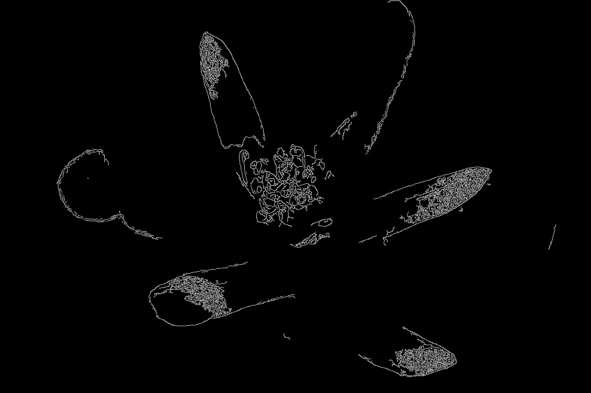
  - *Original Image*:
  

---

### 🔬 Experiment 7: Morphological Dilation
- **Code File:** [exp7.py](/exp7.py)
- **Description:** Performs morphological dilation on a grayscale image using a 5x5 rectangular structuring element and `cv2.dilate`.
- **Outputs:**
  - *Dilated Image*:
  
  - *Original Image*:
  

---

### 🔬 Experiment 8: Morphological Erosion
- **Code File:** [exp8.py](/exp8.py)
- **Description:** Performs morphological erosion on a grayscale image using a 5x5 rectangular structuring element and `cv2.erode`.
- **Outputs:**
  - *Eroded Image*:
  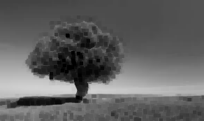
  - *Original Image*:
  

---

### 🔬 Experiment 9: Multi-Speed Video Playback
- **Code File:** [exp9.py](/exp9.py)
- **Description:** Plays a video file at normal (1.0x), slow (0.5x), and fast (3.0x) speeds, demonstrating frame rate timing control.
- **Outputs:**
  - *Video*:
  

---

### 🔬 Experiment 10: Live Webcam Preview with Speed Controls
- **Code File:** [exp10.py](/exp10.py)
- **Description:** Streams live feed from the webcam, enabling dynamic frame processing and virtual speed adjustments via user keys (+/-).
- **Outputs:**
  - *Webcam Video*:
  

---

### 🔬 Experiment 11: Centered Image Rotation
- **Code File:** [exp11.py](/exp11.py)
- **Description:** Calculates and applies an affine transformation to rotate an image around its geometric center by a specific angle.
- **Outputs:**
  - *Original Image*:
  
  - *Transformed Image*:
  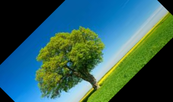

---

### 🔬 Experiment 12: Affine Image Translation
- **Code File:** [exp12.py](/exp12.py)
- **Description:** Applies an affine transformation matrix to translate an image to a new coordinate space.
- **Outputs:**
  - *Moving Image*:
  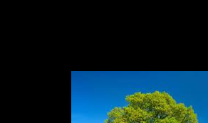

---

### 🔬 Experiment 13: Live Webcam Perspective Transformation
- **Code File:** [exp13.py](/exp13.py)
- **Description:** Captures webcam video, draws four alignment points, and applies perspective warping (`cv2.warpPerspective`) headlessly.
- **Outputs:**
  - *Perspective Transformation*:
  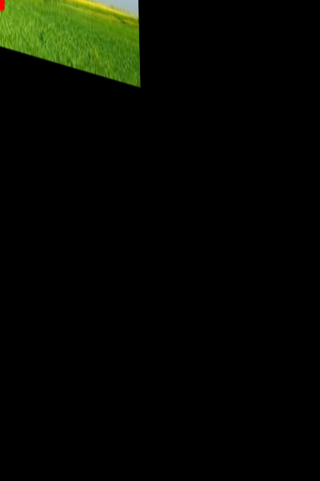
  - *frame*:
  

---

### 🔬 Experiment 14: Homography Perspective Warp
- **Code File:** [exp14.py](/exp14.py)
- **Description:** Loads two images, computes a 3x3 homography matrix from matching point coordinates, and warps the source image onto the destination canvas.
- **Outputs:**
  - *Homography Warp Comparison  Source   Destination   Warped *:
  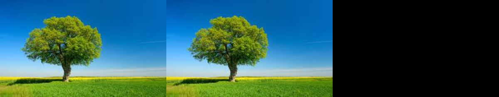

---

### 🔬 Experiment 15: Homography Keypoint Alignment & Blending
- **Code File:** [exp15.py](/exp15.py)
- **Description:** Aligns a source image perspective to a destination image using homography, and blends the warped output onto the destination canvas.
- **Outputs:**
  - *Blended  Destination   Warped *:
  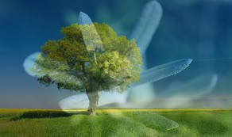
  - *Comparison  Source   Destination   Warped *:
  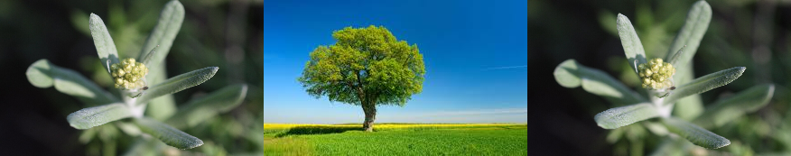

---

### 🔬 Experiment 16: Grayscale Canny Edge Detection
- **Code File:** [exp16.py](/exp16.py)
- **Description:** Loads an image, converts it to grayscale, and applies Canny edge detection with specified threshold values.
- **Outputs:**
  - *Canny Edges*:
  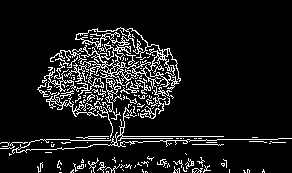
  - *Original Image*:
  

---

### 🔬 Experiment 17: Sobel X Edge Detection
- **Code File:** [exp17.py](/exp17.py)
- **Description:** Calculates the horizontal image derivatives using a Sobel operator (`cv2.Sobel` in X-direction) to extract vertical edges.
- **Outputs:**
  - *Original Image*:
  
  - *Sobel X Edge Detection*:
  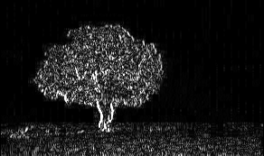

---

### 🔬 Experiment 18: Sobel Y Edge Detection
- **Code File:** [exp18.py](/exp18.py)
- **Description:** Calculates the vertical image derivatives using a Sobel operator (`cv2.Sobel` in Y-direction) to extract horizontal edges.
- **Outputs:**
  - *Original Image*:
  
  - *Sobel Y Edge Detection*:
  

---

### 🔬 Experiment 19: Sobel X & Y Combined Edge Detection
- **Code File:** [exp19.py](/exp19.py)
- **Description:** Calculates both Sobel X and Sobel Y derivatives, combining their magnitudes to retrieve complete structural edge maps.
- **Outputs:**
  - *Combined Sobel*:
  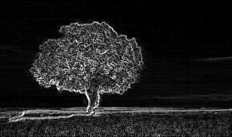
  - *Original Image*:
  
  - *Sobel X*:
  
  - *Sobel Y*:
  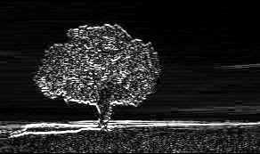

---

### 🔬 Experiment 20: Laplacian Mask & Image Sharpening
- **Code File:** [exp20.py](/exp20.py)
- **Description:** Applies a Laplacian high-pass filter, generates a Laplacian edge mask, and overlays it on the original image to sharpen details.
- **Outputs:**
  - *Laplacian Mask*:
  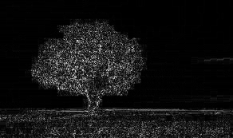
  - *Original Image*:
  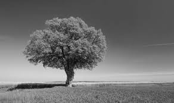
  - *Sharpened Image*:
  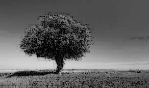

---

### 🔬 Experiment 21: Laplacian Kernel Sharpening (Custom Convolution)
- **Code File:** [exp21.py](/exp21.py)
- **Description:** Sharpens a grayscale image by convolving it with a custom 2D Laplacian sharpening kernel using `cv2.filter2D`.
- **Outputs:**
  - *Original Image*:
  
  - *Sharpened Image*:
  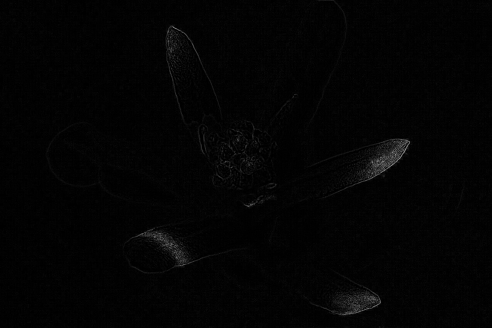

---

### 🔬 Experiment 22: High-Pass Filter Sharpening
- **Code File:** [exp22.py](/exp22.py)
- **Description:** Sharpens a color image by convolving it with a standard high-pass filter kernel via 2D convolution.
- **Outputs:**
  - *Original Image*:
  
  - *Sharpened Image*:
  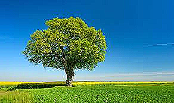

---

### 🔬 Experiment 23: Unsharp Masking
- **Code File:** [exp23.py](/exp23.py)
- **Description:** Implements Unsharp Masking by subtracting a low-pass Gaussian blurred image from the original image to emphasize edges.
- **Outputs:**
  - *Original Image*:
  
  - *Sharpened Image  Unsharp Masking *:
  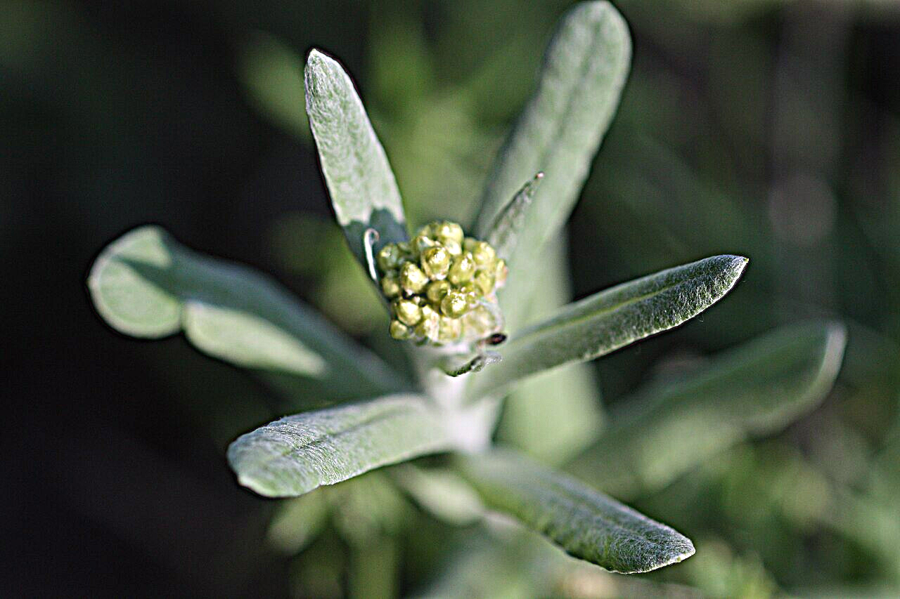

---

### 🔬 Experiment 24: Watermark Image Overlay
- **Code File:** [exp24.py](/exp24.py)
- **Description:** Resizes and overlays a semi-transparent watermark logo image onto a background image using region-of-interest coordinates.
- **Outputs:**
  - *Resized Input Image*:
  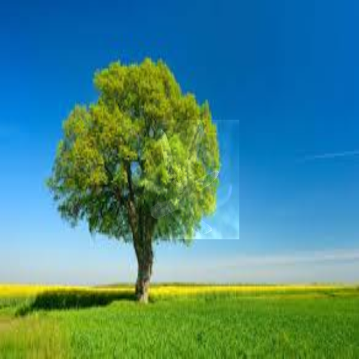

---

### 🔬 Experiment 25: Sharpening via Edge Blending
- **Code File:** [exp25.py](/exp25.py)
- **Description:** Extracts edge detail using Gaussian blurring and Laplacian operators, then blends it back to sharpen the source image.
- **Outputs:**
  - *Original Image*:
  
  - *Sharpened Image*:
  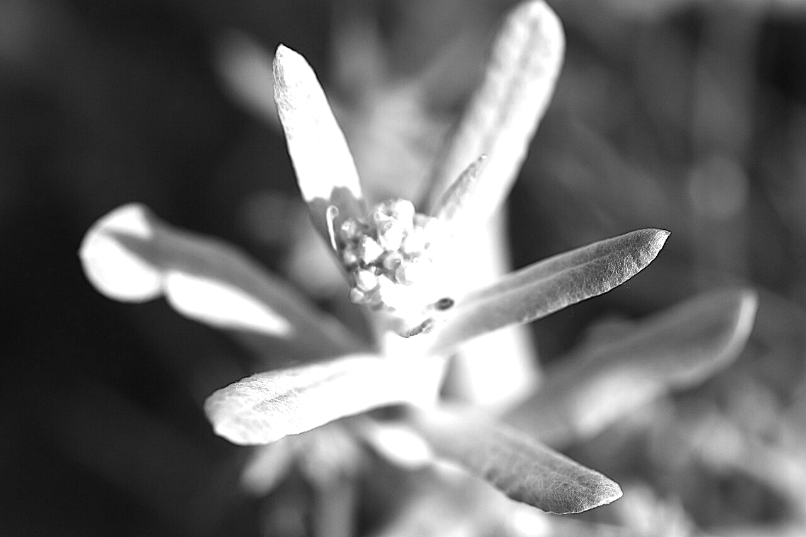

---

### 🔬 Experiment 26: Watermark Weighted Blending
- **Code File:** [exp26.py](/exp26.py)
- **Description:** Blends a watermark logo image with a background image using a weighted linear combination (`cv2.addWeighted`).
- **Outputs:**
  - *Watermarked Image*:
  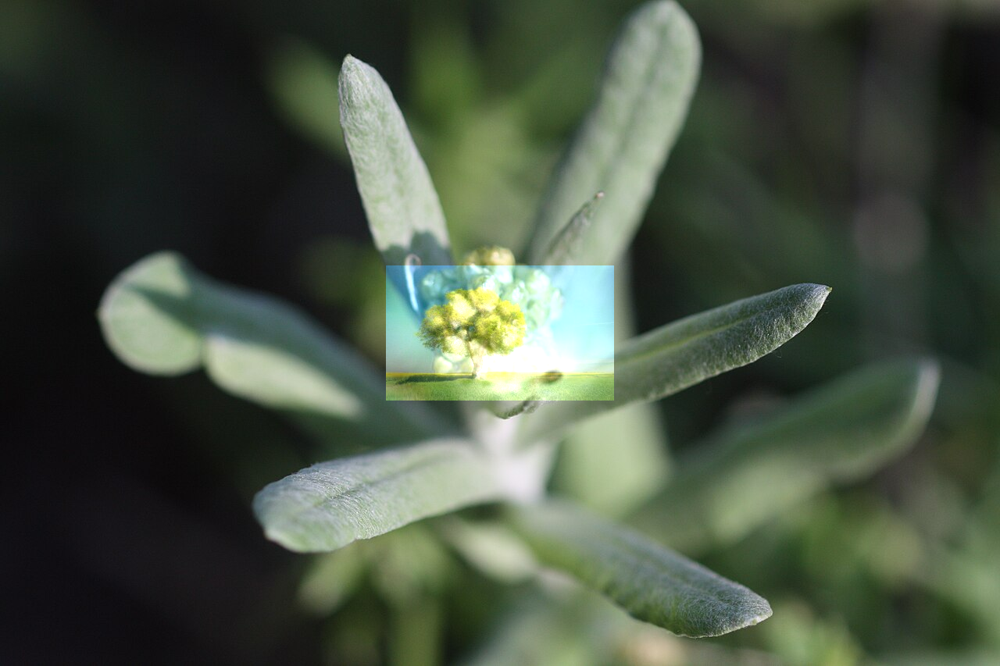

---

### 🔬 Experiment 27: Image Cropping & Copy-Pasting
- **Code File:** [exp27.py](/exp27.py)
- **Description:** Crops a specific rectangular region of interest (ROI) from a source image and pastes it onto another image target.
- **Outputs:**
  - *Result*:
  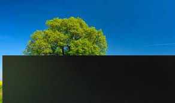

---

### 🔬 Experiment 28: Morphological Boundary Detection (Sobel)
- **Code File:** [exp28.py](/exp28.py)
- **Description:** Finds morphological boundaries of an image using Sobel operators on grayscale thresholds.
- **Outputs:**
  - *Gradient Magnitude  Boundary *:
  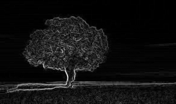
  - *Original Image*:
  

---

### 🔬 Experiment 29: Grayscale Morphological Erosion
- **Code File:** [exp29.py](/exp29.py)
- **Description:** Applies erosion to a grayscale image to diminish bright regions and expand dark features.
- **Outputs:**
  - *Erosion Result*:
  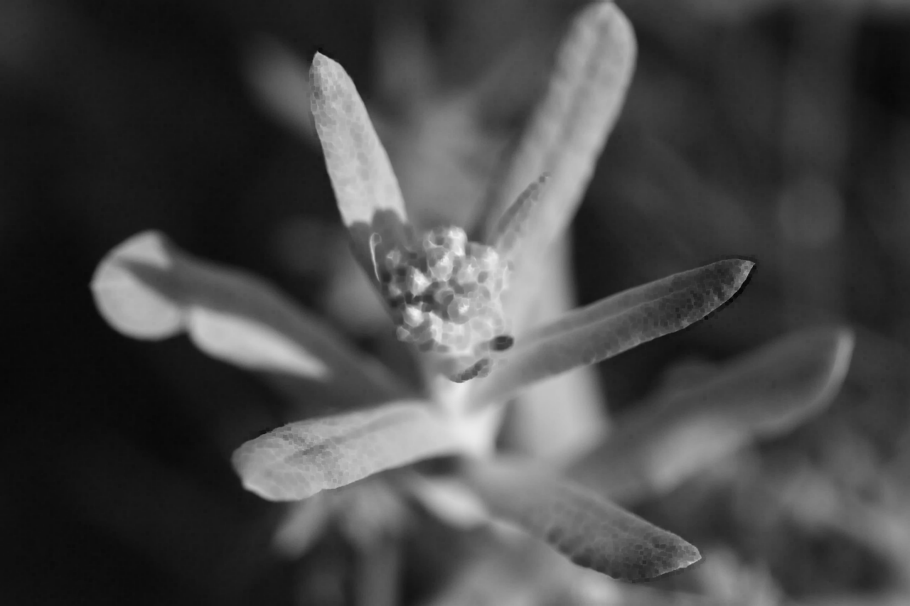
  - *Original Image*:
  

---

### 🔬 Experiment 30: Grayscale Morphological Dilation
- **Code File:** [exp30.py](/exp30.py)
- **Description:** Applies dilation to a grayscale image to expand bright regions and shrink dark features.
- **Outputs:**
  - *Dilated Image*:
  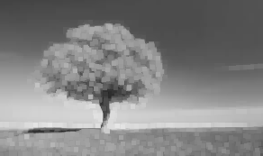
  - *Original Image*:
  

---

### 🔬 Experiment 31: Morphological Opening
- **Code File:** [exp31.py](/exp31.py)
- **Description:** Performs opening (erosion followed by dilation) to remove small noise objects from the image foreground.
- **Outputs:**
  - *Opening Result*:
  
  - *Original Image*:
  

---

### 🔬 Experiment 32: Morphological Closing
- **Code File:** [exp32.py](/exp32.py)
- **Description:** Performs closing (dilation followed by erosion) to close small holes and gaps within foreground shapes.
- **Outputs:**
  - *Closing Result*:
  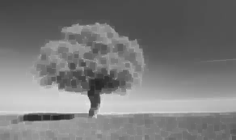
  - *Original Image*:
  

---

### 🔬 Experiment 33: Morphological Gradient
- **Code File:** [exp33.py](/exp33.py)
- **Description:** Calculates the difference between dilation and erosion of an image, highlighting the boundaries and outlines of shapes.
- **Outputs:**
  - *Morphological Gradient*:
  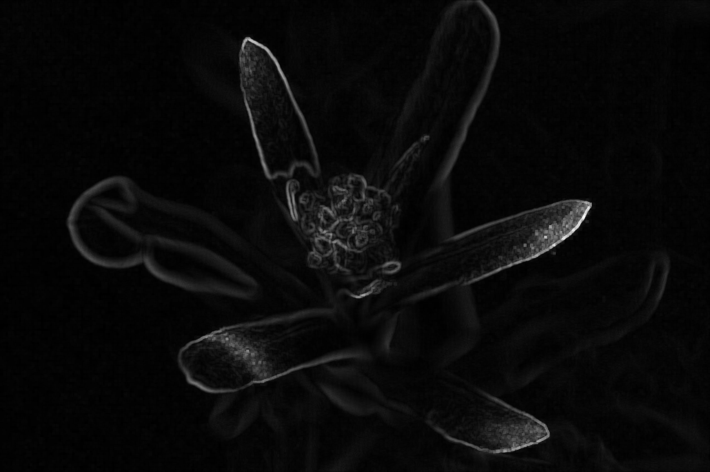
  - *Original Image*:
  

---

### 🔬 Experiment 34: Morphological Top Hat
- **Code File:** [exp34.py](/exp34.py)
- **Description:** Calculates the difference between the original image and its opening, isolating features brighter than their surroundings.
- **Outputs:**
  - *Original Image*:
  
  - *Top Hat Result*:
  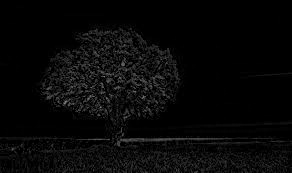

---

### 🔬 Experiment 35: Morphological Black Hat
- **Code File:** [exp35.py](/exp35.py)
- **Description:** Calculates the difference between the closing and the original image, isolating dark structures and valleys.
- **Outputs:**
  - *Black Hat*:
  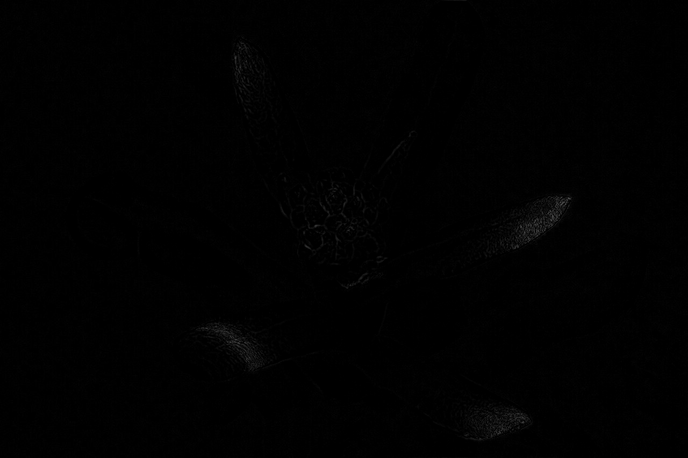
  - *Original Image*:
  

---

### 🔬 Experiment 36: HSV Color Space Object Segmentation
- **Code File:** [exp36.py](/exp36.py)
- **Description:** Converts an image to HSV color space, applies range thresholds (`cv2.inRange`) to filter out colors, and segments target elements.
- **Outputs:**
  - *Watch Recognition*:
  

---

### 🔬 Experiment 37: Reverse Video Playback
- **Code File:** [exp37.py](/exp37.py)
- **Description:** Reads a video file, buffers all frames in memory, and plays/displays them in reverse order.
- **Outputs:**
  - *Video in Reverse*:
  

---

### 🔬 Experiment 38: Haar Cascade Face Detection
- **Code File:** [exp38.py](/exp38.py)
- **Description:** Uses a pre-trained Haar Cascade classifier to scan an image, detect human faces, and draw bounding boxes around them.
- **Outputs:**
  - *Face Detection*:
  

---

### 🔬 Experiment 39: Moving Vehicle Detection (MOG2 Background Subtraction)
- **Code File:** [exp39.py](/exp39.py)
- **Description:** Detects moving vehicles in a video stream using background subtraction, morphological noise removal, and contour tracing.
- **Outputs:**
  - *Vehicle Detection*:
  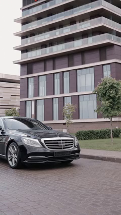

---

### 🔬 Experiment 40: Object Detection & Contour Extraction
- **Code File:** [exp40.py](/exp40.py)
- **Description:** Thresholds a grayscale image, finds object contours, draws bounding rectangles, and extracts each cropped object from the canvas.
- **Outputs:**
  - *Extracted Object*:
  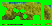
  - *Objects with Rectangles*:
  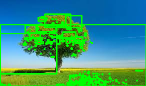

---


## 📝 License
This project is open-source and available under the MIT License.
